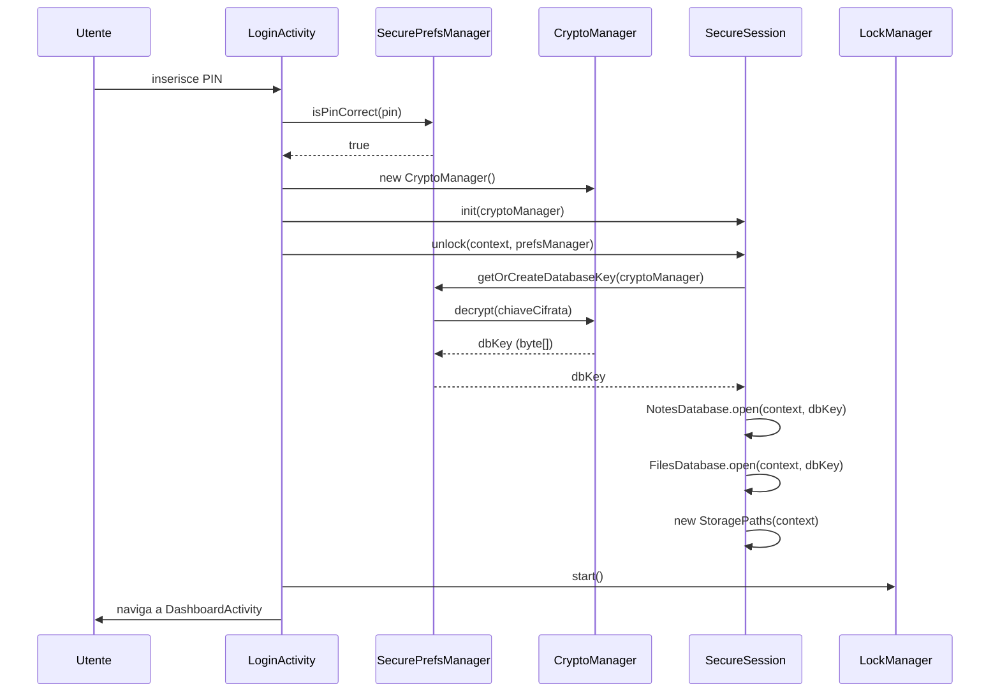
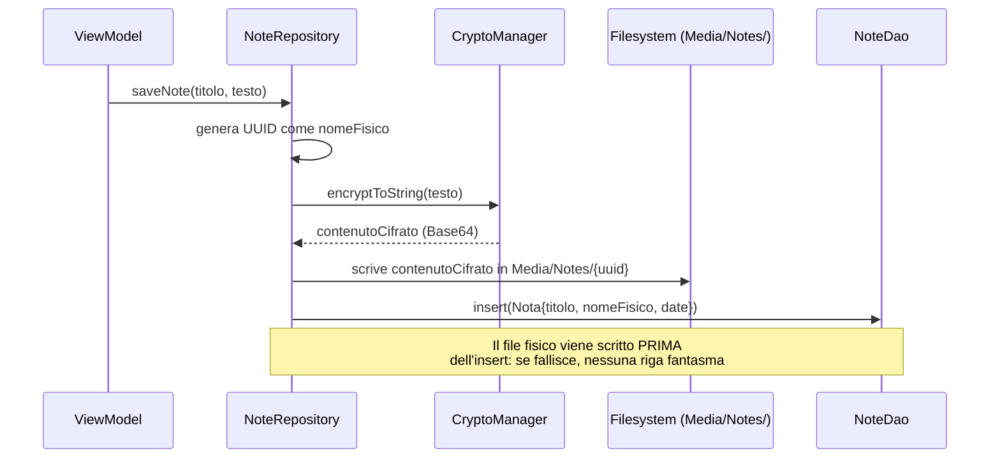
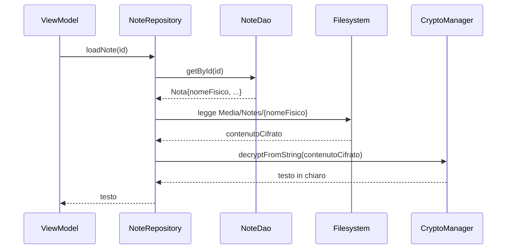
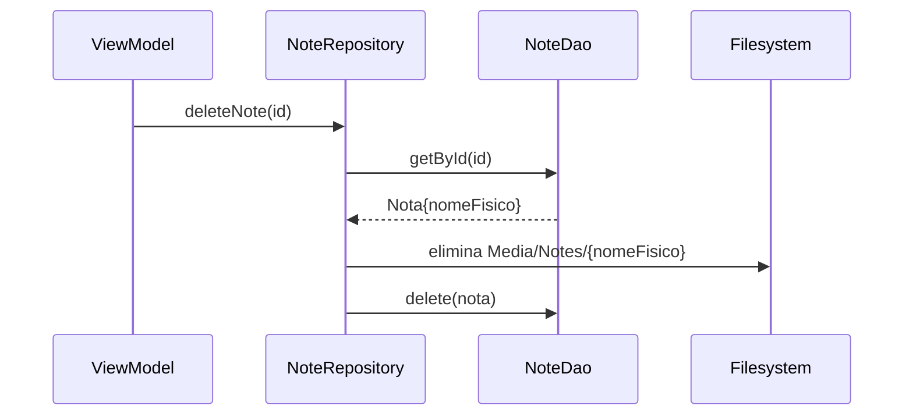
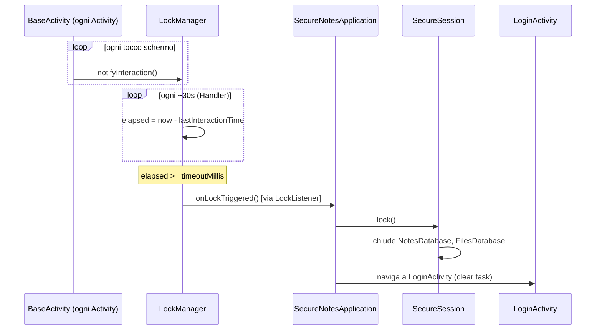
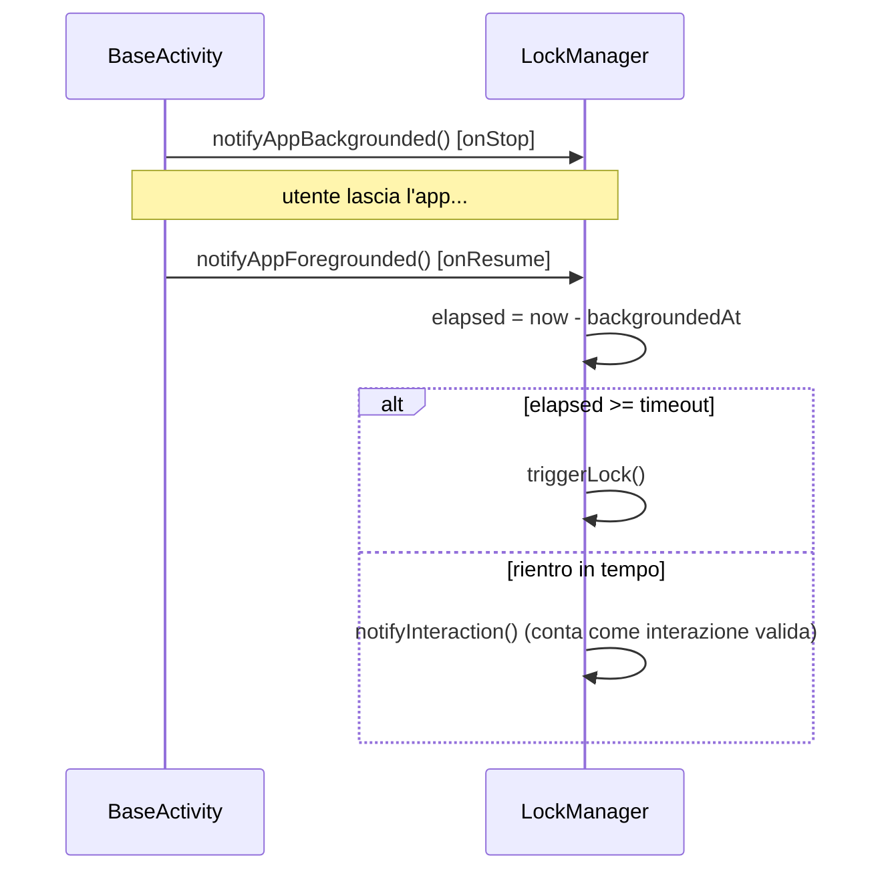

# Flussi e sequenze

Sequenze temporali complete, per capire "chi chiama chi" nell'ordine giusto. I
diagrammi sono in Mermaid — Obsidian li renderizza nativamente aprendo il file.

---

## 1. Login → sessione sbloccata → dashboard

---

## 2. Salvataggio di una nota (identico, concettualmente, per un file)

---

## 3. Caricamento di una nota

---

## 4. Eliminazione (file + riga indice insieme)

---

## 5. Timeout / lock automatico

**Meccanismo parallelo — background prolungato:**

---

## Nota di lettura

Ogni classe in questi diagrammi conosce solo i metodi pubblici di chi chiama —
nessuna sa come è fatta l'implementazione interna delle altre. Se un flusso non
torna, il punto di partenza per il debug è sempre: "quale metodo pubblico è stato
chiamato, e cosa doveva restituire?".
