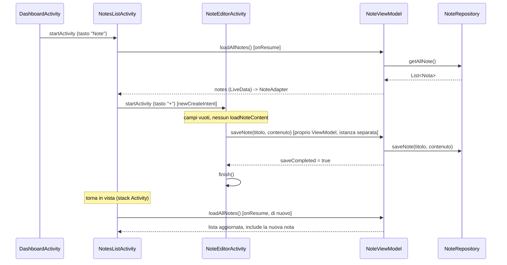

# Livello UI — Note

Classi: `AppExecutors`, `NoteViewModel`, `NoteAdapter`, `NotesListActivity`,
`NoteEditorActivity`
Package: `com.cookie.securenotes.util`, `com.cookie.securenotes.ui.notes`

Questo è il primo ramo di UI completato, e fa da modello per `ui/archivio/` (stessa
struttura: ViewModel + Adapter + Activity, con `FileRepository` al posto di
`NoteRepository`).

---

## `AppExecutors` — perché serve

`NoteRepository` fa I/O su disco e query DB — operazioni lente. Se venissero chiamate
direttamente dall'UI thread (l'unico thread che disegna l'interfaccia e reagisce ai
tocchi), l'app si bloccherebbe per tutta la loro durata, fino al possibile crash per
"non risponde" (ANR).

`AppExecutors` è un singleton con due strumenti:

- **`diskIO()`**: un `ExecutorService` a **thread singolo** — esegue codice su un
  thread di sfondo separato. Thread singolo (non un pool) apposta: serializza tutte
  le operazioni su DB/filesystem, evitando che due scritture concorrenti si
  accavallino su SQLCipher o sui file.
- **`mainThread(Runnable)`**: riporta un blocco di codice sull'UI thread — necessario
  perché una `LiveData` va sempre aggiornata da lì.

Schema usato ovunque nel `ViewModel`:

```java
executors.diskIO().execute(() -> {              // 1. lavoro lento, thread di sfondo
    Object risultato = repository.qualcheOperazione();
    executors.mainThread(() -> {                // 2. torna sull'UI thread
        liveData.setValue(risultato);
    });
});
```

---

## `NoteViewModel`

**Ruolo**: unico punto di contatto tra le Activity e `NoteRepository`. Espone lo stato
tramite `LiveData`, così le Activity si limitano a *osservare* — non chiamano mai
`NoteRepository` direttamente.

**Importante**: `NotesListActivity` e `NoteEditorActivity` creano **ciascuna la propria
istanza** di `NoteViewModel` (`new ViewModelProvider(this).get(NoteViewModel.class)`,
con `this` = quella specifica Activity). Sono due oggetti Java distinti, anche se
stessa classe — nessuno stato è condiviso automaticamente tra le due schermate.

### LiveData esposte

| LiveData | Popolata da | Osservata da |
| --- | --- | --- |
| `notes` (`List<Nota>`) | `loadAllNotes()`, `search(query)` | `NotesListActivity` → `NoteAdapter.submitList` |
| `errorMessage` (`String`) | qualunque metodo, in caso di `CryptoException`/`IOException` | entrambe le Activity → `Toast` |
| `editorTitle` / `editorContent` (`String`) | `loadNoteContent(id)` | `NoteEditorActivity` → popola i campi |
| `saveCompleted` (`Boolean`) | `saveNote(...)` | `NoteEditorActivity` → `finish()` |

### Metodi principali

- `loadAllNotes()` / `search(query)`: popolano `notes`.
- `saveNote(titolo, contenuto)`: salva (nuova nota o sovrascrittura, a seconda di come
  viene chiamato da `NoteEditorActivity`), poi segnala `saveCompleted = true` — **non**
  ricarica la lista da qui, perché la lista vive in un'altra Activity/istanza
  ViewModel. È `NotesListActivity.onResume()` a farsene carico.
- `deleteNote(id)`: elimina e ricarica la lista — qui ha senso perché avviene nella
  stessa Activity/istanza che mostra la lista.
- `loadNoteContent(id)`: chiama sia `repository.getTitolo(id)` che
  `repository.loadNote(id)` (due letture separate: il titolo viene dal DB in chiaro,
  il contenuto dal file cifrato) e popola `editorTitle`/`editorContent`.

---

## `NoteAdapter` (RecyclerView)

**Ruolo**: traduce la `List<Nota>` in righe visibili (`item_note.xml`). Espone
un'interfaccia annidata `OnNoteClickListener` (tap = apri/modifica, long-press =
elimina) — annidata perché ha senso solo in relazione a questo adapter specifico,
nessun'altra classe la userebbe slegata da lui.

`submitList()` usa `notifyDataSetChanged()` (non `DiffUtil`) — scelta accettabile per
liste piccole e locali come questa; da rivedere solo se in futuro le note diventano
centinaia e gli aggiornamenti percepibilmente lenti.

---

## `NotesListActivity`

**Ruolo**: mostra la lista, la barra di ricerca, il tasto "+". Estende `BaseActivity`
(quindi eredita il tracciamento lock/timeout automaticamente).

Punti chiave del ciclo di vita:

- `onCreate()`: crea il ViewModel, collega `RecyclerView`/`EditText`/FAB, registra gli
  observer. **Non** chiama `loadAllNotes()` qui.
- `onResume()`: chiama `super.onResume()` (fondamentale — è lì che `BaseActivity`
  verifica se la sessione è ancora sbloccata) **e poi** `viewModel.loadAllNotes()` —
  così la lista si aggiorna sia al primo ingresso sia ogni volta che si torna da
  `NoteEditorActivity` dopo un salvataggio.
- `onSupportNavigateUp()`: la freccia "indietro" nella toolbar chiama `finish()` —
  torna alla `DashboardActivity` sottostante nello stack di navigazione, che Android
  gestisce da solo (nessun codice esplicito necessario per "tornare alla dashboard").

## `NoteEditorActivity`

**Ruolo**: una sola Activity per **sia creazione che modifica**, distinte tramite un
`extra` opzionale nell'`Intent`:

```java
NoteEditorActivity.newCreateIntent(context)          // nessun id -> modalità creazione
NoteEditorActivity.newEditIntent(context, notaId)     // con id -> modalità modifica
```

Se `editingNoteId` è presente, `onCreate()` chiama `viewModel.loadNoteContent(id)` per
popolare i campi; altrimenti parte vuota. Al tap su "Salva", valida che il titolo non
sia vuoto e chiama `viewModel.saveNote(...)`; l'observer su `saveCompleted` chiude
l'Activity quando il salvataggio va a buon fine, riportando l'utente automaticamente
alla lista sottostante (stesso meccanismo di stack di `NotesListActivity`).

---

## Layout coinvolti

| File | Usato da | Contiene |
| --- | --- | --- |
| `activity_notes.xml` | `NotesListActivity` | `TextInputLayout` ricerca, `RecyclerView`, `TextView` stato vuoto, FAB |
| `item_note.xml` | `NoteAdapter` | `MaterialCardView` con il titolo della nota |
| `activity_note_editor.xml` | `NoteEditorActivity` | Campo titolo, campo contenuto multilinea, bottone salva |

---

## Sequenza completa: dalla Dashboard alla nota salvata



---

## Stato: cosa è completo, cosa resta aperto

✅ Creazione, apertura/modifica, ricerca, eliminazione singola, navigazione
indietro coerente con lo stack di Android.

⬜ Non ancora implementato (vedi [06-punti-aperti.md](06-punti-aperti.md)):
- Modalità selezione multipla per l'eliminazione (punto aperto del documento originale).
- Stato vuoto (`emptyStateText`) presente nel layout ma non ancora collegato — va
  mostrato/nascosto in base a `notes.size() == 0` dentro l'observer di `NotesListActivity`.
